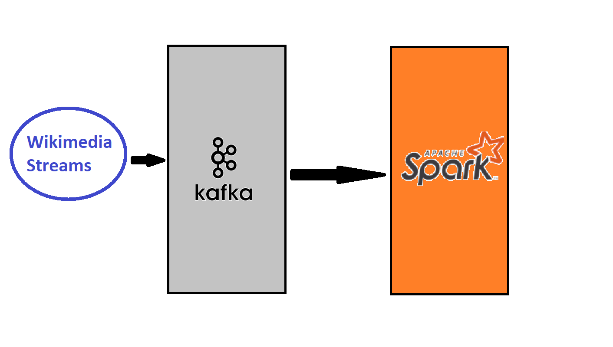

## Wikimedia Data Stream
________________________

### About this project

This project was created to implement the knowledge that I was learning
about Apache Spark and Apache Kafka.
I use [wikimedia streams](https://stream.wikimedia.org/v2/ui/#/) to get the data of 
new created wikimedia articles.
The data enters from a Kafka producer and then consumed by Spark where I use some 
low level rdds spark api to count the number of appearence of every domain of the stream
and later save the domains and the total of appearences in csv file.

